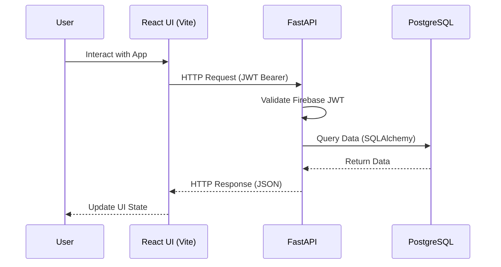
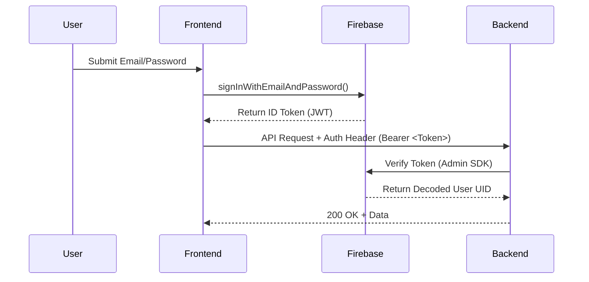
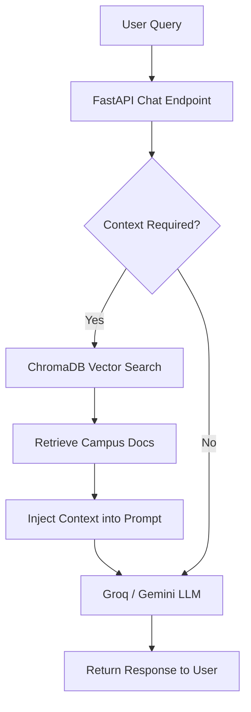
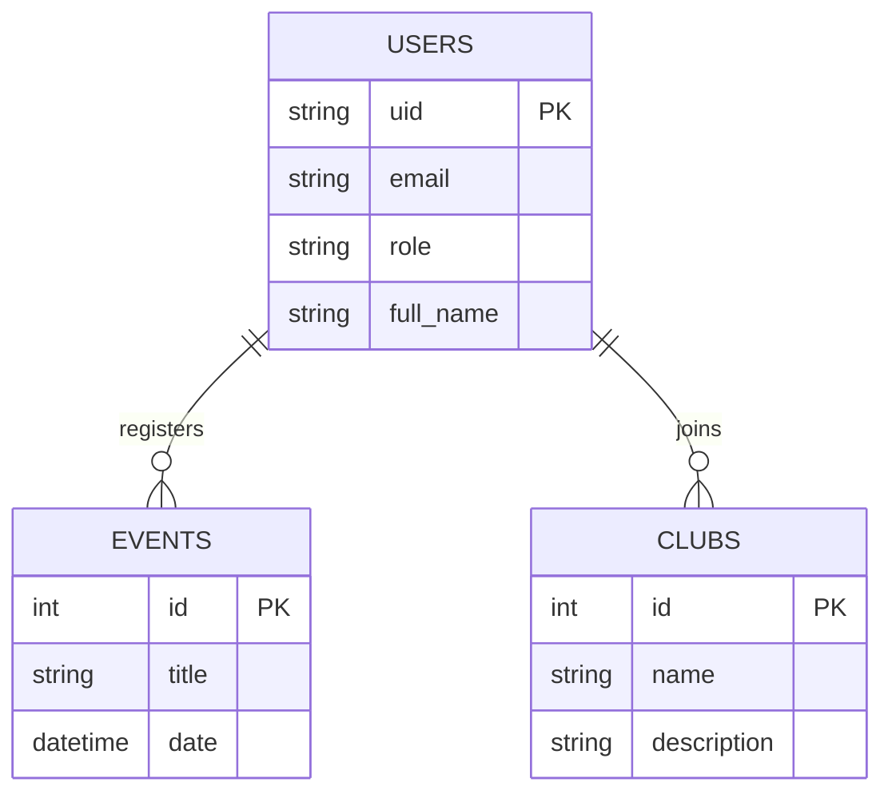
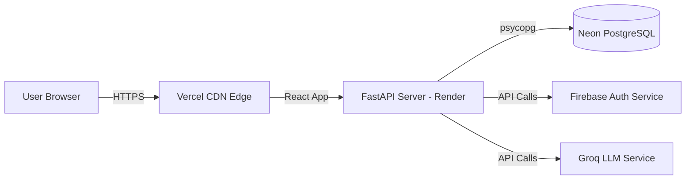

# System Architecture

This document describes the architectural layout of SCE Student Portal.

## Frontend → Backend Communication

## Authentication Flow

## AI Chatbot & RAG Pipeline

## Database Architecture

## Deployment Architecture

